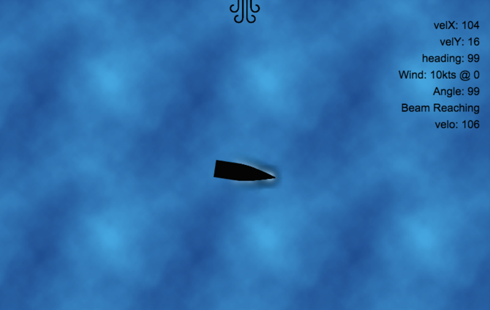

Sailr
-------------------------------------------------------------------------------

A 2D Adventure Sailing Game as a platform for learning and physics simulation. All Javascript for compatibility with your favorite device. Built with [Phaser](http://phaser.io/)

## Running Instructions

    git clone https://github.com/ithunt/sailr.git
    cd sailr

The entire game is in `index.html`. Host the directory with a simple http server

    python -m SimpleHTTPServer 8080

Check it out [http://localhost:8080](http://localhost:8080)

## Features

* Basic Wind Angle and Velocity Physics
* Tiller like steering
* Crappy images

## In Development

* Velocity based on your angle from the wind
* Wind pressure affects acceleration and max speed
* A sailboat image
* Varying sea state & weather conditions

